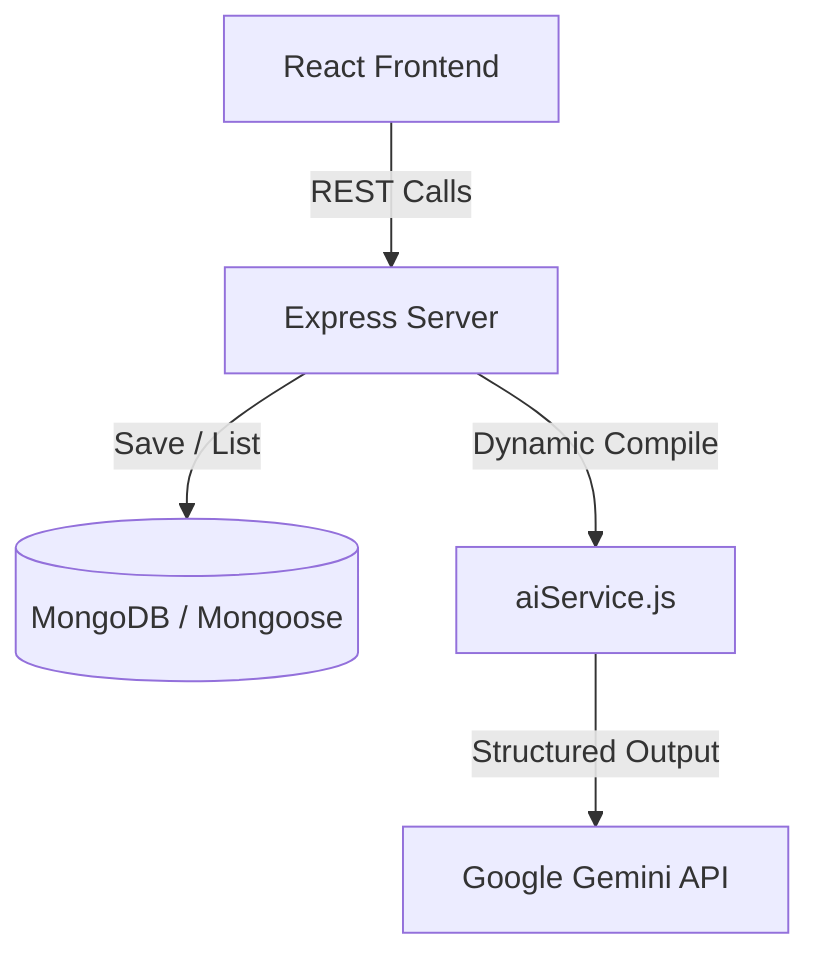

# ⚡ WorkflowGen AI — Process Automation & Structured Documentation System

WorkflowGen AI is a full-stack, configuration-driven web application designed to transform raw, unstructured inputs into high-value structured business documentation (such as Operational Reports, Standard Operating Procedures, and Meeting Summaries) using Google Gemini's native structured JSON schemas.

---

## 🚀 Core Features

1. **Five Core Built-In Workflows**: Preconfigured out of the box:
   * **Research Summarizer**: Distills research material into key findings, methodology, and gaps.
   * **Meeting Documentation**: Generates meeting reviews with action items and key decisions.
   * **SOP Generator**: Creates step-by-step operating guidelines from unstructured descriptions.
   * **Operational Report**: Compiles department updates into metrics and highlight logs.
   * **Professional Email**: Standardizes drafts into formal executive correspondences.
2. **Custom Workflow Builder**: Allows dynamic definition of new templates, system prompts, form inputs, and JSON schemas directly in the UI.
3. **Dynamic Form Engine**: Reads database configurations and renders HTML forms (text, textareas, select options) on the fly.
4. **Execution Persistence & Logs**: Logs runs with inputs, duration, status, and AI responses.
5. **Process Improvement Insights**: Submits custom manual procedures for Gemini review to identify automation bottlenecks.
6. **Productivity Metrics**: Aggregates time saved based on standard multipliers to show simulated productivity impact.

---

## 🏗️ Architecture



The application is split into:
* **Frontend**: React + Vite SPA using CSS custom properties for responsive design.
* **Backend**: Express + Mongoose (MongoDB) database layer.
* **AI Service**: Google GenAI Node SDK integration using `gemini-3.7-flash` with JSON output schemas.

---

## 🛠️ Technology Stack

* **Frontend**: React.js 18, Vite, Lucide React (Icons), Native Window.fetch
* **Backend**: Node.js, Express.js, Mongoose ODM
* **Database**: MongoDB (Local or Atlas)
* **Generative AI**: `@google/genai` (SDK v2.19.0) calling `gemini-3.7-flash`

---

## 📂 Folder Structure

```text
workflowgen-ai/
├── backend/
│   ├── config/
│   │   └── db.js                 # MongoDB connection
│   ├── models/
│   │   ├── Workflow.js           # Workflow schema
│   │   └── Execution.js          # Execution history log schema
│   ├── controllers/
│   │   ├── workflowController.js # Built-in & custom template queries
│   │   ├── executionController.js# Compilation and run orchestration
│   │   └── insightController.js  # Productivity stats and process audit
│   ├── routes/
│   │   ├── workflowRoutes.js     # /api/workflows endpoints
│   │   ├── executionHistoryRoutes.js # /api/executions history
│   │   ├── executionRoutes.js    # /api/executions runner
│   │   └── insightRoutes.js      # /api/insights audits
│   ├── services/
│   │   └── aiService.js          # Google Gemini SDK caller
│   ├── server.js                 # Express server entry point
│   └── package.json
└── frontend/
    ├── src/
    │   ├── components/
    │   │   ├── Layout.jsx        # Sidebar navigation shell
    │   │   ├── DynamicForm.jsx   # Dynamic input form renderer
    │   │   └── StructuredResult.jsx # Dynamic structured result renderer
    │   ├── pages/
    │   │   ├── Dashboard.jsx     # Overview & aggregate stats
    │   │   ├── WorkflowLibrary.jsx # Built-in & custom library
    │   │   ├── WorkflowExecution.jsx # Live form inputs & AI outputs
    │   │   ├── CustomWorkflowBuilder.jsx # Form configuration designer
    │   │   ├── ExecutionHistory.jsx # Stored execution browser
    │   │   └── ProcessInsights.jsx # Manual process audits
    │   ├── services/
    │   │   └── api.js            # Standardized fetch endpoints
    │   └── App.jsx               # Navigation router
    └── package.json
```

---

## ⚙️ Environment Variables

### Backend Configuration (`backend/.env`)
Create a file at `backend/.env` with placeholders:
```env
PORT=5000
MONGODB_URI=mongodb://127.0.0.1:27017/workflowgen
GEMINI_API_KEY=<your-google-gemini-api-key>
GEMINI_MODEL=gemini-3.7-flash
```

### Frontend Configuration (`frontend/.env`)
Create a file at `frontend/.env`:
```env
VITE_API_URL=http://localhost:5000/api
```

---

## 🏁 Local Setup Instructions

### Prerequisites
* Node.js (v18+)
* MongoDB (running locally on port `27017`)

### 1. Database Seeding
Ensure MongoDB is running locally, then run the seed script to write the five core templates:
```bash
cd backend
npm install
npm run seed
```

### 2. Start Backend Development Server
```bash
npm run dev
```
The server will start at `http://localhost:5000`. Query `http://localhost:5000/api/health` to confirm database connectivity.

### 3. Start Frontend Development Server
```bash
cd ../frontend
npm install
npm run dev
```
The app will start at `http://localhost:5173`. Open it in your web browser.

### 4. Build for Production
To verify compilations and prepare optimized assets:
```bash
cd frontend
npm run build
```

---

## 🔌 API Endpoint Summary

| Method | Endpoint | Description |
| :--- | :--- | :--- |
| `GET` | `/api/health` | Service health status |
| `GET` | `/api/workflows` | List all available templates |
| `GET` | `/api/workflows/:id` | Fetch specific workflow detail |
| `POST` | `/api/workflows` | Save a new custom workflow definition |
| `POST` | `/api/executions/:workflowId` | Run workflow: compiles fields and calls AI |
| `GET` | `/api/executions` | Fetch recent execution run logs |
| `GET` | `/api/executions/:id` | Fetch individual execution data |
| `POST` | `/api/insights` | Run AI analysis on manual processes |
| `GET` | `/api/insights/stats` | Aggregate execution stats and time-saving metrics |

---

## 🛡️ Security & Sanitation Safeguards

1. **Isolated Credentials**: The Gemini API key resides solely in `backend/.env`. It is never returned in API payloads, console outputs, or frontend bundles.
2. **Error Sanitation**: System error messages are sanitised by the backend before persistence or client delivery to prevent stack trace leaks or API credential disclosure.
3. **Database Ignored**: `.env` files are ignored in `.gitignore` to prevent committing sensitive keys.

---

## 📊 Productivity Estimate Methodology

All time-saved metrics in the dashboard and insights panels represent demonstration estimates of assumed manual effort, not measured real-world metrics.
* Research Summarizer: **20 minutes**
* Meeting Documentation: **30 minutes**
* SOP Generator: **45 minutes**
* Operational Report: **60 minutes**
* Professional Email: **10 minutes**
* Custom Workflows: **15 minutes** (default)

A notice is displayed inside the UI to clarify this multiplier framework for demonstration purposes.

---

## ⚠️ Known Limitations
* **Gemini Availability (HTTP 503)**: Google Gemini API keys may occasionally experience capacity overloads resulting in temporary `503 Service Unavailable` errors. The application is equipped with a bounded 1-retry mechanism. If the retry fails, it is logged gracefully as a `'failed'` execution and returned without crashing.
